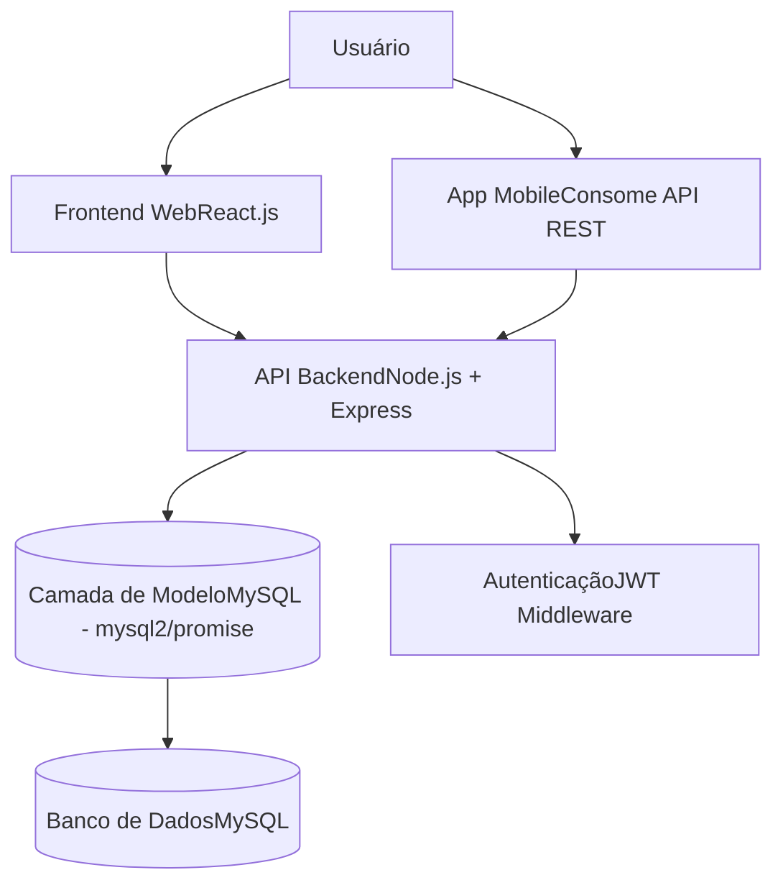

# Arquitetura final implementada
### 📌 Diagrama de Arquitetura (alto nível)

```mermaid
flowchart TD
    A[Usuário] --> B[Frontend WebReact.js]
    A --> C[App MobileConsome API REST]
    B --> D[API BackendNode.js + Express]
    C --> D
    D --> E[(Camada de ModeloMySQL - mysql2/promise)]
    D --> F[AutenticaçãoJWT Middleware]
    E --> G[(Banco de DadosMySQL)]
```
